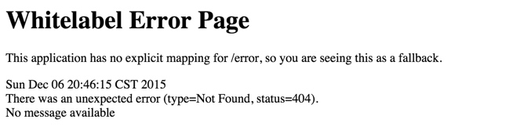
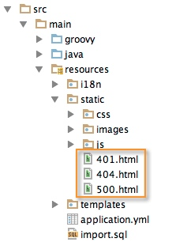

## Spring boot
想搞个JSP的WEB程序TM难，我搞了很久也没搞出来，反正是放弃了。不得已改用 thymeleaf 模板

###Spring Boot Web工程很多默认的配置，需要注意：
    1. 模板文件默认路径：/templates/
    2. 静态文件默认路径：/static/

 注意在模板文件中引用静态文件的时候不要实际的相对路径来，否则前端会报＜404＞错误。例如：

```html
    <!--静态资源默认目录在static-->
    <script src="/js/socket.io.js" type="text/javascript"></script>
    <script src="/js/jquery-1.7.2.min.js" type="text/javascript"></script>
    <script src="/basic/remind.js" type="text/javascript"></script>
```

### Whitelabel Error Page处理方式



Spring Boot默认使用嵌入式Tomcat，默认没有页面来处理404等常见错误。因此，为了给用户最佳的使用体验，404等常见错误需要我们自定义页面来处理。

我们需要用org.springframework.boot.context.embedded.EmbeddedServletContainerCustomizer类来实现该功能，在Spring Boot的启动类（main方法所在类）当中，添加如下代码：
```java
@Bean
public EmbeddedServletContainerCustomizer containerCustomizer() {

   return (container -> {
        ErrorPage error401Page = new ErrorPage(HttpStatus.UNAUTHORIZED, "/401.html");
        ErrorPage error404Page = new ErrorPage(HttpStatus.NOT_FOUND, "/404.html");
        ErrorPage error500Page = new ErrorPage(HttpStatus.INTERNAL_SERVER_ERROR, "/500.html");
    
        container.addErrorPages(error401Page, error404Page, error500Page);
   });
}
```

这是使用Java 8的lambda表达式来简化实现的方式，在代码中创建了三个ErrorPage实例来处理三个通用的HTTP错误状态码，并将他们添加到container当中。ErrorPage类是一个封装了错误信息的类，它可以在Jetty和Tomcat环境下使用。

这是使用Java 7内部类的一个等价实现方式：
```java
@Bean
public EmbeddedServletContainerCustomizer containerCustomizer() {

    return new EmbeddedServletContainerCustomizer() {
        @Override
        public void customize(ConfigurableEmbeddedServletContainer container) {
    
            ErrorPage error401Page = new ErrorPage(HttpStatus.UNAUTHORIZED, "/401.html");
            ErrorPage error404Page = new ErrorPage(HttpStatus.NOT_FOUND, "/404.html");
            ErrorPage error500Page = new ErrorPage(HttpStatus.INTERNAL_SERVER_ERROR, "/500.html");
    
            container.addErrorPages(error401Page, error404Page, error500Page);
        }
    };
}
```

错误页面需要放在Spring Boot web应用的static内容目录下，它的默认位置是：src/main/resources/static，如下图所示：

